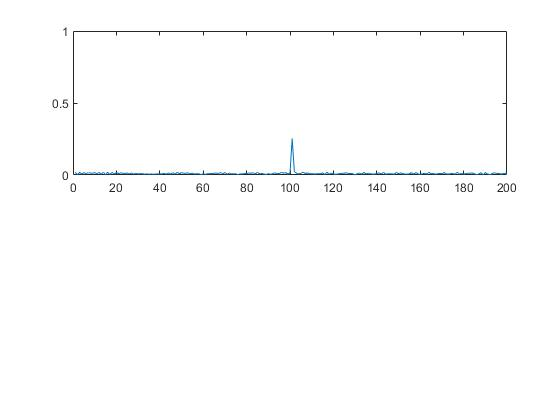
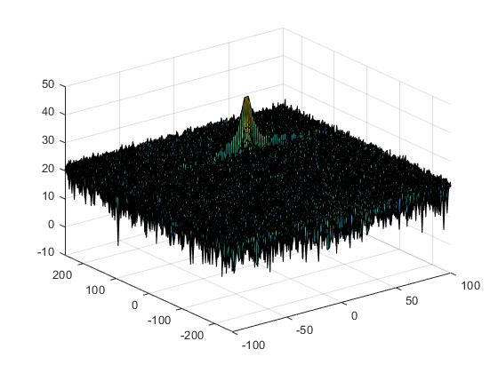
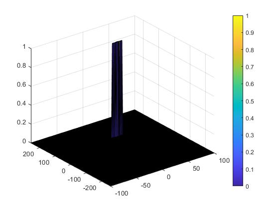

# SFND-Radar project

## Implementation steps for the 2D CFAR process
* Selct the CUT (Cell Under Test) and loop over the range doppler map in each iteration with predefined margin <br>
`for i = Tr+Gr+1 : (Nr/2)-(Gr+Tr)`<br>
`for j = Td+Gd+1 : Nd-(Gd+Td)`
* For each iteration loop over the training cells and exclude the guarding cells <br>
`for p = i-(Tr+Gr) : i+(Tr+Gr)`<br>
`for q = j-(Td+Gd) : j+(Td+Gd)`
* Calculate the noise value in each iteration <br>
`noise_level = noise_level + db2pow(RDM(p,q));`
* Calculate threshold value using pow2db<br>
`thres = pow2db(noise_level/(2*(Td+Gd+1)*2*(Tr+Gr+1)-(Gr*Gd)-1));`
* Add the offset value
`thres = thres + offset;`
* If the CUT is greater than threshold, replace it by `1`, otherwise `0` <br>
```
if (CUT > thres)
	RDM(i,j) = 1;
else
	RDM(i,j) = 0;
end
```
## Selection of Training, Guard cells and offset
* `Tr = 12, Td = 10` For both Range and Doppler Training Cells.
* `Gr = 4, Gd = 4` For both Range and Doppler Guard Cells.
* `offset = 7` The offset value.

## Steps taken to suppress the non-thresholded cells at the edges
The process will generate a thresholded block, which is smaller than the Range Doppler Map as the CUT cannot be located at the edges of matrix. Hence, few cells will not be thresholded. To keep the map size same set those values to 0. <br>
`RDM(union(1:(Tr+Gr),end-(Tr+Gr-1):end),:) = 0;  % Rows`<br>
`RDM(:,union(1:(Td+Gd),end-(Td+Gd-1):end)) = 0;  % Columns`

## Result
Result of FFT

Result of range-Doppler map

Result of CA-CFAR


