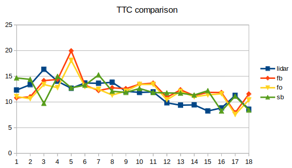

# SFND 3D Object Tracking

Welcome to the final project of the camera course. By completing all the lessons, you now have a solid understanding of keypoint detectors, descriptors, and methods to match them between successive images. Also, you know how to detect objects in an image using the YOLO deep-learning framework. And finally, you know how to associate regions in a camera image with Lidar points in 3D space. Let's take a look at our program schematic to see what we already have accomplished and what's still missing.


In this final project, you will implement the missing parts in the schematic. To do this, you will complete four major tasks: 
1. First, you will develop a way to match 3D objects over time by using keypoint correspondences. 
2. Second, you will compute the TTC based on Lidar measurements. 
3. You will then proceed to do the same using the camera, which requires to first associate keypoint matches to regions of interest and then to compute the TTC based on those matches. 
4. And lastly, you will conduct various tests with the framework. Your goal is to identify the most suitable detector/descriptor combination for TTC estimation and also to search for problems that can lead to faulty measurements by the camera or Lidar sensor. In the last course of this Nanodegree, you will learn about the Kalman filter, which is a great way to combine the two independent TTC measurements into an improved version which is much more reliable than a single sensor alone can be. But before we think about such things, let us focus on your final project in the camera course. 

## Dependencies for Running Locally
* cmake >= 2.8
  * All OSes: [click here for installation instructions](https://cmake.org/install/)
* make >= 4.1 (Linux, Mac), 3.81 (Windows)
  * Linux: make is installed by default on most Linux distros
  * Mac: [install Xcode command line tools to get make](https://developer.apple.com/xcode/features/)
  * Windows: [Click here for installation instructions](http://gnuwin32.sourceforge.net/packages/make.htm)
* Git LFS
  * Weight files are handled using [LFS](https://git-lfs.github.com/)
* OpenCV >= 4.1
  * This must be compiled from source using the `-D OPENCV_ENABLE_NONFREE=ON` cmake flag for testing the SIFT and SURF detectors.
  * The OpenCV 4.1.0 source code can be found [here](https://github.com/opencv/opencv/tree/4.1.0)
* gcc/g++ >= 5.4
  * Linux: gcc / g++ is installed by default on most Linux distros
  * Mac: same deal as make - [install Xcode command line tools](https://developer.apple.com/xcode/features/)
  * Windows: recommend using [MinGW](http://www.mingw.org/)

## Basic Build Instructions

1. Clone this repo.
2. Make a build directory in the top level project directory: `mkdir build && cd build`
3. Compile: `cmake .. && make`
4. Run it: `./3D_object_tracking`.

## Match 3D Objects

```
void matchBoundingBoxes(std::vector<cv::DMatch> &matches, std::map<int, int> &bbBestMatches, DataFrame &prevFrame, DataFrame &currFrame)
{
    for (auto &prevBox : prevFrame.boundingBoxes)
    {
        std::map<int, int> tmp;
        for (auto &currBox : currFrame.boundingBoxes)
        {
            for (auto &match : matches)
            {
                auto &prevKeyPoint = prevFrame.keypoints[match.queryIdx].pt;
                if (prevBox.roi.contains(prevKeyPoint))
                {
                    auto &currKeyPoint = currFrame.keypoints[match.trainIdx].pt;
                    if (currBox.roi.contains(currKeyPoint))
                    {
                        tmp[currBox.boxID] = tmp[currBox.boxID] + 1;;
                    }
                }

            } // end of iterating all keypoint matches

        } // end of iterating all current bounding boxes

        auto bestMatch = std::max_element(tmp.begin(), tmp.end(), [](const std::pair<int, int> &kpt1, const std::pair<int, int> &kpt2) {return kpt1.second < kpt2.second;});

        bbBestMatches[prevBox.boxID] = bestMatch->first;

    } // end of iterating all previous bounding boxes
}
```

## Compute Lidar based TTC
```
void computeTTCLidar(std::vector<LidarPoint> &lidarPointsPrev,
                     std::vector<LidarPoint> &lidarPointsCurr, double frameRate, double &TTC)
{
     // auxiliary variables
    double dT = 1/frameRate;        // time between two measurements in seconds
    double laneWidth = 4.0;         // assumed width of the ego lane
    double averageXCurr = 0;
    double averageXPrev = 0;

    // find closest distance to Lidar points within ego lane
    double minXPrev = 1e9, minXCurr = 1e9;
    for (auto it = lidarPointsPrev.begin(); it != lidarPointsPrev.end(); ++it)
    {
      if ( abs(it->y) <= (laneWidth/2)){
        averageXPrev += it->x;
      }
    }

    for (auto it = lidarPointsCurr.begin(); it != lidarPointsCurr.end(); ++it)
    {
      if( abs(it->y) <= (laneWidth/2)){
        averageXCurr += it->x;
      }
    }

    if (!lidarPointsPrev.empty()) { 
        averageXPrev /= lidarPointsPrev.size();   
    }

    if (!lidarPointsCurr.empty()) { 
        averageXCurr /= lidarPointsCurr.size();  
    }


    for (auto point : lidarPointsCurr) {
        double threshold = 0.75 * averageXCurr;

        if (point.x > threshold) { 
            minXCurr = point.x; 
        }
    }

    // compute TTC from both measurements
    TTC = (minXCurr * dT) / (averageXPrev - averageXCurr);

    std::cout<<"Lidar TTC: "<<TTC<<endl;
    std::cout<<"Xmin: "<<minXCurr<<endl;
}
```

## Associate Keypoint Correspondences with Bounding Boxes
```
void clusterKptMatchesWithROI(BoundingBox &boundingBox, std::vector<cv::KeyPoint> &kptsPrev, std::vector<cv::KeyPoint> &kptsCurr, std::vector<cv::DMatch> &kptMatches)
{
    // calculate mean point match distance in the bounding box
    double sum = 0;
    double size = 0;

    for (auto it = kptMatches.begin(); it != kptMatches.end(); ++it)
    {
        cv::KeyPoint currKeyPoint = kptsCurr[it->trainIdx];
        cv::KeyPoint prevKeyPoint = kptsPrev[it->queryIdx];

        if (boundingBox.roi.contains(currKeyPoint.pt))
        {
            sum += cv::norm(currKeyPoint.pt - prevKeyPoint.pt);
            size +=1;
        }
    }

    double mean = sum / size;

    // filter point match based on point match distance
    for (auto it2 = kptMatches.begin(); it2 != kptMatches.end(); ++it2)
    {
        cv::KeyPoint currKeyPoint = kptsCurr[it2->trainIdx];
        cv::KeyPoint prevKeyPoint = kptsPrev[it2->queryIdx];

        if (boundingBox.roi.contains(currKeyPoint.pt))
        {
            double curr_dist = cv::norm(currKeyPoint.pt - prevKeyPoint.pt);

            if (curr_dist < mean * 1.5)
            {
                boundingBox.keypoints.push_back(currKeyPoint);
                boundingBox.kptMatches.push_back(*it2);
            }
        }
    }
}
```

## Compute camera based TTC

```
void computeTTCCamera(std::vector<cv::KeyPoint> &kptsPrev, std::vector<cv::KeyPoint> &kptsCurr, 
                      std::vector<cv::DMatch> kptMatches, double frameRate, double &TTC, cv::Mat *visImg)
{
    // compute distance ratios between all matched keypoints
    vector<double> distRatios; // stores the distance ratios for all keypoints between curr. and prev. frame
    for (auto it1 = kptMatches.begin(); it1 != kptMatches.end() - 1; ++it1)
    { // outer kpt. loop

        // get current keypoint and its matched partner in the prev. frame
        cv::KeyPoint kpOuterCurr = kptsCurr.at(it1->trainIdx);
        cv::KeyPoint kpOuterPrev = kptsPrev.at(it1->queryIdx);

        for (auto it2 = kptMatches.begin() + 1; it2 != kptMatches.end(); ++it2)
        { // inner kpt.-loop

            double minDist = 100.0; // min. required distance

            // get next keypoint and its matched partner in the prev. frame
            cv::KeyPoint kpInnerCurr = kptsCurr.at(it2->trainIdx);
            cv::KeyPoint kpInnerPrev = kptsPrev.at(it2->queryIdx);

            // compute distances and distance ratios
            double distCurr = cv::norm(kpOuterCurr.pt - kpInnerCurr.pt);
            double distPrev = cv::norm(kpOuterPrev.pt - kpInnerPrev.pt);

            if (distPrev > std::numeric_limits<double>::epsilon() && distCurr >= minDist)
            { // avoid division by zero

                double distRatio = distCurr / distPrev;
                distRatios.push_back(distRatio);
            }
        } // eof inner loop over all matched kpts
    }     // eof outer loop over all matched kpts

    // only continue if list of distance ratios is not empty
    if (distRatios.size() == 0)
    {
        TTC = NAN;
        return;
    }

    // compute camera-based TTC from distance ratios
    std::sort(distRatios.begin(),distRatios.end());
    long medianIdx = floor(distRatios.size()/2);
    double medDistRatio = distRatios.size() % 2 == 0 ? (distRatios[medianIdx - 1] + distRatios[medianIdx])/2 : distRatios[medianIdx];

    double dT = 1 / frameRate;
    TTC = -dT / (1 - medDistRatio);

    std::cout<<"Camera TTC: "<<TTC<<endl;
}
```

## Performance evaluation of Lidar TTC
The task is complete once several examples (2-3) have been identified and described in detail. The assertion that the TTC is off should be based on manually estimating the distance to the rear of the preceding vehicle from a top view perspective of the Lidar points.

Based on the results, I found one example of inaccurate Lidar based TTC estimation as shown in following figures. The TTC estimation suddently goes to negative value from the first figure to the second figure and bounce back to positive value from the second figure to the third figure in consecutive.

|Frame No. |TTC |Xmin|
|:---:|:-----:|:----:|
|28 |11.8211 s| 5.95 m |
|29 |-23.5506 s |5.74 m |
|30 |8.14053 s|5.79 m |


This is due to the flucuration in the denominator that drives the whole value to negative. Because the vehicle is moving slowly, the average value of minimum range in current frame and previous frame are close and its difference could possibly be nagetive. 

## Performance evaluation of different detector/descriptor

Based on results from previous project, the 3 best combinations are FAST/BRIEF, FAST/ORB and SHITOMASI/BRIEF. The comparision of camera based TTC with these three combinations are shown in below.

|Frame No. |Lidar TTC |FAST/BRIEF | FAST/ORB | SHITOMASI/BRIEF|
|:----:|:-----:|:----:|:-----:|:-----:|
|1 |12.3245 |10.8026 |11.0544 |14.6756|
|2 |13.3658 |11.0063 |10.6351 |14.4019 |
|3 |16.3633 |14.1559 |13.4008 |9.73978 |
|4 |14.038 |14.3886 |12.7761 |14.982 |
|5 |12.6624 |19.9511 |18.0923 |12.7503 |
|6 |13.6958 |13.293 |12.9892 |13.2703 |
|7 |13.6398 |12.2182 |12.4642 |15.2664 |
|8 |13.8336 |12.7596 |11.3522 |12.0847 |
|9 |12.0968 |12.6 |12.1119 |11.8703 |
|10 |11.8623 |13.4637 |13.4169 |12.6285 |
|11 |11.9584 |13.6717 |13.4175 |11.8507 |
|12 |9.83108 |10.9087 |10.4239 |11.7642 |
|13 |9.37912 |12.3705 |12.0462 |11.7197 |
|14 |9.43773 |11.2431 |11.0103 |11.3557 |
|15 |8.25041 |11.8747 |11.3841 |12.1983 |
|16 |8.84877 |11.8398 |11.6 |8.23961 |
|17 |11.2891 |7.92013 |7.56799 |11.1382 |
|18 |8.57706 |11.554 |10.3912 |8.43097 |

Compared to the Lidar based TTC, the camera-based TTC is not stable. There are few values of camera-based TTC that change back and forth with more than 2 seconds in consecutive frames, which is not as consistent as TTC estimation using Lidar. This is because the calculation of TTC using camera used the median distance ratio and it assumed that all associated points are in the same plane. However, there are cases when some wrong matched points are counted as mactched keypoints and lead to inconsistency of TTC estimation. The comparison plot can be shown as below.




